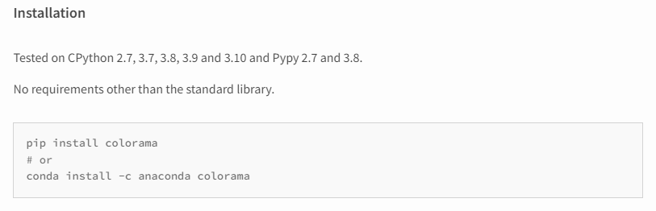
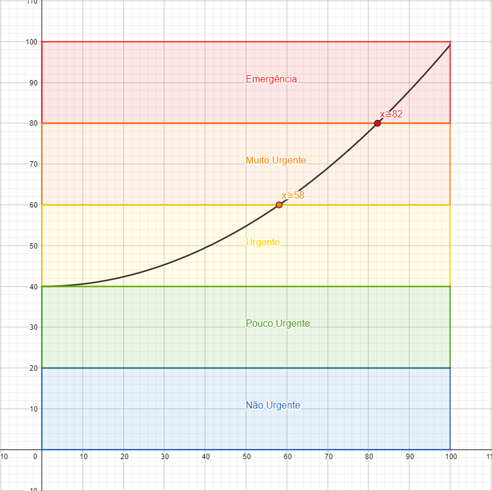
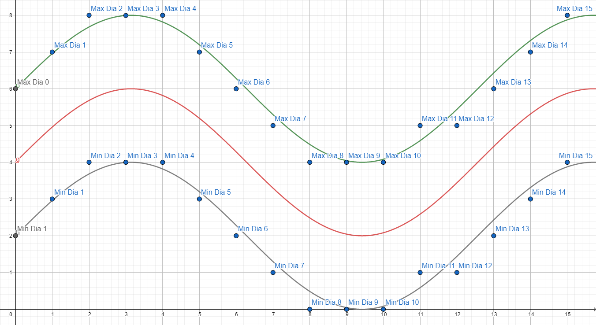
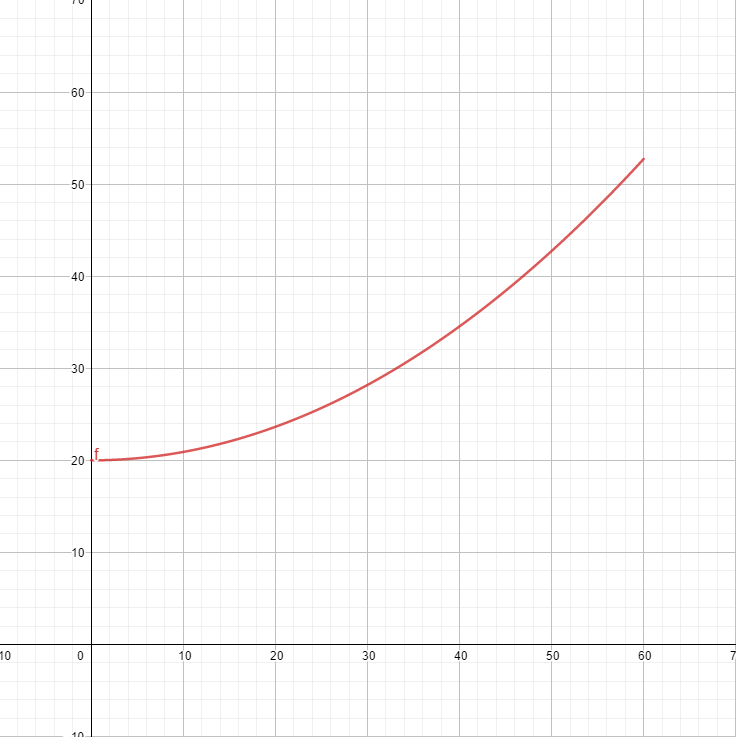
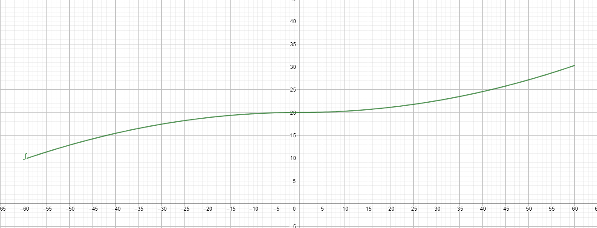

# Regulação de Leitos de UTI - Solução
*Por Lucas Teixeira Borges*

## Demanda:
Construção de um simulador capaz de gerenciar demandas e disponibilidades de leitos de UTI geradas aleatoriamente, levando em conta a prioridade das pessoas em condição crítica e o tempo de espera de cada paciente, além de atribuir pacientes de uma certa faixa etária aos leitos correspondentes (liberando primeiro os leitos mais recentes). Ademais, o uso de estruturas prontas da linguagem Python é vetado. Sendo assim, foi necessário escolher e implementar as estruturas de dados e algoritmos a serem utilizados no projeto.
## Preparação para uso do programa:
O programa foi desenvolvido e testado num computador com o Windows 10 e o Python 3.8.2 instalado, mas deve funcionar também em dispositivos Linux e com versões mais recentes do Python.
Para desfrutar da experiência completa do simulador, deve ser instalado o pacote "[Colorama](https://pypi.org/project/colorama/#description)", responsável por colorir as impressões  no terminal de algumas partes da simulação.  

*Figura 1 - Screenshot de seção da página do Colorama contendo instruções para instalação do pacote.*

Caso a instalação do pacote seja mal sucedida, e o programa não consiga importar o pacote, o funcionamento do programa não deve ser comprometido: nesse caso, o simulador apenas perderá a capacidade de exibir os dados de maneira mais clara (imprimindo os registros de pacientes de uma cor diferente para cada código de emergência).
## Uso do programa:
Para iniciar o simulador, o usuário deve rodar o código contido no arquivo `main.py`. Ao executar o programa, o usuário é recebido com um pedido de inserção de um valor, que será utilizado para definir a quantidade máxima de pacientes que chegarão em um ciclo da simulação (que representa 1 dia). O valor padrão utilizado é 8, que é o mesmo valor máximo empregado na geração de leitos, para gerar uma simulação equilibrada.
Para cada ciclo da simulação, o usuário deve submeter um input. Esse input deve ser "sair" para encerrar a execução do programa, um inteiro não nulo para definir o número de dias que ele quer que a simulação avance, ou uma outra entrada qualquer (simplesmente apertar enter também funciona) para simular o próximo dia da simulação.
O usuário então receberá um relatório do estado atual da simulação, contendo: 
 - O número total de mortos;
 - Vezes em que um paciente foi encaminhado para um leito; 
 - Vezes que um paciente deixou de necessitar de um leito na UTI;
 - Uma lista para fila de cada ala, contendo os registros de cada paciente coloridos de acordo com a situação do paciente (caso o módulo Colorama tenha sido importado com sucesso), começando pelo paciente no começo da fila e indo até o final;
 - Uma lista contendo os leitos disponíveis de cada Ala, começando pelos mais recentemente liberados até os liberados há mais tempo;
 - E, por fim, uma lista das mudanças que ocorreram no ciclo atual da simulação (Chegada de pacientes, leitos liberados, encaminhamento de pacientes para leitos, óbito de pacientes na fila, mudança de código de emergência de um paciente, e a melhora de pacientes a ponto de não necessitarem mais de um leito na UTI)
 ## TADs e Estruturas implementadas:
 **cLista**
 
Para guardar elementos numa lista, eu escolhi implementar uma lista duplamente encadeada com referência ao início e fim. Essa escolha, em oposição a um vetor, se deu pois eu não queria estar limitado pela obrigatoriedade de estabelecer uma quantidade máxima de elementos na criação da lista, uma vez que a situação lida com eventos com certo grau de imprevisibilidade, e as listas devem ser capazes de armazenar uma quantidade indefinida de elementos.
O uso de uma lista com referência a início e fim é justificado pela necessidade que se deu de criar listas que devem seguir a política *FIFO* (*First In First Out*) no gerenciamento das filas de espera pelo atendimento dos pacientes, em que o fácil acesso ao início da lista é importante para termos acesso a e direcionarmos o primeiro elemento de acordo, assim como é importante o fácil acesso ao fim da lista, para que novos elementos sejam adicionado sem que tenhamos que percorrer toda a lista para inserir um item no final. O uso de uma lista com referência a início e fim nesse caso é capaz de reduzir a complexidade de operações como inserção de um novo elemento no final da fila de $O(n)$ para $O(1)$. 

Ademais, o uso de uma lista duplamente encadeada se fez útil pois, em muitos casos, era mais eficiente percorrer a lista num determinado sentido, e em outros casos, em outro sentido, e isso só se mostrou possível com o uso do encadeamento duplo, em que cada um dos nós da lista (implementados com o TAD `cNo`) possui uma referência não só ao nó sucessor, mas também ao nó predecessor a si próprio.

Por fim, a classe `cLista` também possui uma chave que permite que ela seja definida como uma lista ordenada, o que significa que, quando um novo elemento for inserido nela, ele será  inserido na posição correta, utilizando uma das sub-rotinas fundamentais do algoritmo `Insert Sort`, que é, começando pelo último elemento, ir comparando elemento a elemento para encontrar a posição correta do novo elemento. Isso implica que, no melhor caso (quando a posição correta é no fim da lista) essa inserção se dá com complexidade  $O(1)$, e no pior caso (quando a posição correta é no começo da lista), $O(n)$. Essa funcionalidade foi útil especialmente nos casos em que a condição dos pacientes flutuavam durante sua estadia na fila, e então precisavam ser realocados para uma nova posição de acordo com seu novo código de emergência.

**cPilha**

Para o armazenamento dos leitos liberados, não foi necessário uma estrutura tão complexa quanto a utilizada para armazenamento dos pacientes. Como no caso dos leitos nós fomos orientados a alocar os leitos mais recentes, a política *LIFO* (*Last In First Out*) foi aplicada, então o acesso para inserir e remover leitos é feito do mesmo ponto: do topo da pilha. Sendo assim, não se fez necessário o uso de uma lista com referência ao início e ao fim. Além disso, como, diferentemente dos pacientes, que podem sair da fila estando no meio dela (por falecerem ou melhorarem após a flutuação da suas condições) e precisam ser acessados a cada ciclo, os leitos do meio da pilha não precisam ser acessados e, portanto, não é necessário "percorrer" a pilha em momento algum, não foi necessário o uso de nós com encadeamento duplo. Por isso, implementei também a classe `cNoSimples`, que possui referência apenas ao nó sucessor ao atual.

**cHumano**

O TAD cHumano é uma classe cuja instância representa um paciente de hospital. Um cHumano possui 5 atributos:
 - *Registro do SUS:*
 Um código numérico de 9 dígitos único gerado aleatoriamente e associado ao paciente. Para evitar a duplicidade de IDs, ao gerar um registro, o sistema verifica se já existe um paciente na fila ou um paciente morto com esse registro e, se for o caso, gera um novo.
 
 - *Coeficiente de Risco atual:*
  Uma representação numérica da condição atual do paciente que vai de 0 a 99. De 0 a 19 o paciente está no Código Azul (Não Urgente), de 20 a 39 o paciente está no Código Verde (Pouco Urgente), de 40 a 59 o paciente está no Código Amarelo (Urgente), de 60 a 79 o paciente está no Código Laranja (Muito Urgente), de 80 a 99 o paciente está no Código Vermelho (Emergência). Se esse valor ultrapassa 99, o paciente falece.
  
 - *Coeficiente de Risco inicial:*
 Esse valor é correspondente ao coeficiente de risco gerado quando o paciente chega na fila de espera por um leito da UTI e é imutável. É sempre no mínimo 40, pois pacientes de Código Verde e melhores não necessitam de um leito na UTI.
 
 - *Faixa Etária:*
 Cada paciente possui uma faixa etária associada a ele, que pode ser Neonatal, Pediátrica, ou Adulta. Esse valor é armazenado como um número de 0 a 2.
 
 - *Momento de Chegada:*
 Além do código de emergência do paciente, o segundo critério utilizado para determinar a posição de um paciente na fila é o tempo de espera do paciente na fila. Para isso, o momento de chegada do paciente é armazenado como um *FPN* (*Floating Point Number*) cuja parte inteira representa o dia em que o paciente chegou na fila, e a parte racional representa o "momento" do dia em que o paciente chegou. Na simulação, cada paciente é gerado com um momento de chegada único, independente de terem chegado no mesmo dia.
 
**cLeito**

 Uma instância da classe cLeito representa um leito de hospital. Ela possui 2 atributos:
 
 - *Faixa Etária Destinada:*
 Cada leito pode ser destinado ou a pacientes da Ala Neonatal, ou da Ala Pediátrica ou da Ala Adulta. Não é possível alocar leitos para um paciente cuja faixa etária é diferente da qual o leito é destinado. Esse valor é armazenado como um número de 0 a 2.
 
 - *Registro:*
 Cada leito possui um registro único utilizado para identificá-lo. Esse registro é um código de 9 dígitos, em que os 3 primeiros dígitos são referentes ao ID do hospital no qual o leito está localizado, o último dígito (que pode ser 0, 1 ou 2) é referente a ala no qual o leito está localizado (Neonatal, Pediátrica ou Adulta), e a função dos 5 dígitos que antecedem o último é identificar o leito em meio aos leitos de uma mesma ala do mesmo hospital.

## Eventos Probabilísticos:
O simulador gera situações aleatórias, com base na probabilidade de certos eventos. Para a criação de uma simulação mais realista e que permitisse a observação mais concreta do comportamento do gerenciamento de leitos, os eventos probabilísticos foram definidos após muita reflexão e testes com diferentes valores.

**Geração de humanos**

A cada ciclo é gerado um número aleatório de pacientes de 0 até o número inserido pelo usuário no início da simulação (o valor padrão é 8).
Quando um humano é gerado, é preciso gerar aleatoriamente 3 valores:

 - *Registro do paciente:*
 Como esse valor não possui impacto prático na simulação, e tem intuito apenas de identificar os pacientes, não é necessário muita complexidade: o código gera um registro aleatório de 9 dígitos, e verifica a unicidade do registro. Se já existir um paciente com o mesmo registro (o que e bem difícil, considerando que são 1bi de possibilidades de registros), o programa gera novos registros até gerar um registro único.
 
 - *Faixa Etária:*
 Como o intervalo de tempo de vida referente a classificação Neonatal é menor que o intervalo da classificação Pediátrica, que por si é menor que o intervalo da classificação Adulta, não é coerente que exista a mesma chance de geração para cada faixa etária. Por outro lado, atribuir uma chance "realística" para cada faixa etária seria prejudicial a observação da simulação, uma vez que a quantidade de adultos no mundo é absurdamente maior que a quantidade de bebês no mundo. Por isso, eu distribui os pesos para cada faixa etária da seguinte forma: peso 1 para Neonatal, peso 2 para Pediátrico e peso 3 para Adulto.
 
 - *Coeficiente de Risco:*
 Para ter um maior controle da situação dos pacientes e da flutuação de suas respectivas condições, eu escolhi criar essa representação numérica do estado dos pacientes. Os pacientes que chegam devem ter um coeficiente de risco de, no mínimo, 40, visto que alguém com um coeficiente de risco menor estaria no código de emergência Verde ou Azul, portanto, não necessitariam de um leito na UTI. Ademais, não me pareceu realístico simplesmente gerar um valor de 40 a 99 e definir como o coeficiente de risco do paciente, uma vez que coeficientes de riscos mais baixos são bem mais prováveis de aparecer. Isso acontece pois alguém que está no Código Vermelho, por exemplo, já deveria ter sido enviado à fila da UTI há muito tempo (assim que se tornou elegível para tal, quando chegou no coeficiente de risco 40). Dessa forma, quanto maior o coeficiente, menor deve ser a chance de que esse seja o valor gerado para o paciente. Tendo isso em mente, programei o simulador para gerar um valor $x$ de 0 a 100 e, a partir dele, calcular o coeficiente de risco correspondente a partir da seguinte função:
 $C(x) = \frac{x^2}{169} + 40$
 

*Figura 2: Gráfico mostrando a função que atribui o valor aleatório gerado a um coeficiente de risco. Na simulação, os valores são arredondados para o número inteiro mais próximo.*

**Geração de um leito**

Quando é criado, o leito possui um método parecido com o dos pacientes de ter seu registro gerado. A diferença é que o último dígito deve ser 0, 1 ou 2, correspondente a faixa etária a qual o leito é destinado. Os pesos da distribuição da quantidade de leitos para cada faixa etária é o  mesmo que o os pesos utilizados na decisão da faixa etária de humanos gerados, para não haver uma disparidade muito grande em relação a proporção de pessoas de uma certa faixa etária e leitos destinados a essa mesma faixa etária.
A quantidade de leitos gerados num dia é sempre entre 0 e 8, mas é um pouco mais complexa que a definição de quantos pacientes serão gerados em um dia. Inicialmente era sempre um intervalo fixo. Porém, o comportamento das filas era sempre o mesmo, acabava que com o tempo, ou as filas de pacientes iam crescendo indefinidamente ou as pilhas de leitos iam crescendo indefinidamente, ou as filas e as pilhas acabavam ficando estagnadas. Pensando nisso, decidi que seria interessante que os leitos viessem em ondas, para ser possível observar o comportamento da simulação durante momentos em que poucos leitos são disponibilizados e vice versa. Para isso, o intervalo das quantidades possíveis de leitos gerados varia em função do dia da simulação.  A função $f(x)$ descreve a função "média" de leitos gerados no dia $x$. A quantidade máxima de leitos liberados no dia é definida por $g(x) = f(x) + 2$, enquanto a quantidade de leitos liberados no mesmo dia é definida pela função $h(x) = f(x) - 2$. A função "média" é definida da seguinte forma: $f(x) = 2\sin{(\frac{x}{2}) + 4}$. O programa então aproxima o resultado para o inteiro mais próximo.

*Figura 3: Gráfico que demonstra a definição da quantidade máxima e mínima de leitos gerados em um dia.*

**Flutuação de estado dos pacientes durante espera na fila:**

A cada ciclo, há uma chance da condição de paciente um paciente em espera na fila flutuar. No dia no qual o paciente chega na UTI, essa chance é de 20%. A partir do dia seguinte, essa chance é definida em função da variação do Coeficiente de Risco do paciente desde que ele chegou na fila. Eu decidi fazer isso pois é evidente que pacientes em que essa variação foi grande possuem uma condição instável e irão possuir uma chance maior de "mutação" do coeficiente de risco. Por isso, quando maior a variação, mais a probabilidade de ocorrer uma flutuação no coeficiente cresce. A função que determina a probabilidade de ocorrer a flutuação é descrita da seguinte forma: $f(\Delta c) = \frac{\Delta c^2}{110} + 20$.

*Figura 4 - Gráfico representando o cálculo da chance de flutuação do coeficiente do paciente. Eixo X: Variação do Coeficiente de Risco. Eixo Y: Probabilidade de flutuação, em %.*

Uma vez definido que haverá flutuação da condição do paciente, é preciso definir se essa flutuação será uma melhora ou uma piora. Pra isso, tomaremos como base a diferença do coeficiente de risco inicial para o coeficiente de risco atual ($x = c_0 - c$). A chance de melhora naturalmente será menor que a chance de piora, uma vez que os pacientes entraram na fila por estarem vindo de um histórico recente de piora e chegaram num estado em que era necessário um leito na UTI. Porém, pacientes que, dentro da fila variaram para um coeficiente de risco menor que o inicial possuem uma chance maior que os outros de seguirem melhorando. Por isso, quanto maior o valor de $x$, mais a chance de melhora cresce. A função que descreve o crescimento da chance de melhora em função de $x$ é definida por: $\frac{x^2 sgn(x)}{350} + 20$ em que $sgn(x)$ é o sinal de $x$, definido por -1 se $x<0$; $1$ se $x > 0$; e $0$ se $x = 0$.

*Figura 5: Gráfico representando o cálculo da probabilidade da flutuação de um paciente ser uma melhora. Eixo X: Diferença do CR inicial para o CR atual. Eixo Y: Probabilidade da mudança ser uma melhora em %.*

Por fim, caso a condição do paciente tenha flutuado, a magnitude da flutuação e decidida aleatoriamente, escolhendo um número entre 5 e 15 para ser reduzido ou acrescentado ao coeficiente de risco atual do paciente, a depender de se a flutuação foi uma melhora ou piora.
Em seguida, caso o paciente tenha mudado de categoria de emergência, essa mudança será relatada, se o paciente tiver passado para o código de emergência verde e não precisar mais de um leito, essa mudança também será relatada, assim como será relatada a mudança caso o CR do paciente atinja 100 e ele, portanto, venha a óbito.
